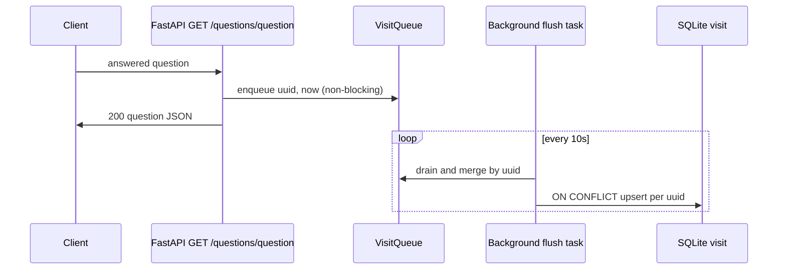

# Phased Python Backend Rewrite

> **Canonical delivery plan** for the Go → Python migration.  
> **Implementation reference:** [Appendix A](#appendix-a--implementation-reference) (project structure, config, repositories, resolved decisions).  
> **LLM (Phase 3 only):** [`2026-05-17-deepseek-moderation-design.md`](./2026-05-17-deepseek-moderation-design.md) — deferred; do not expand here.

**Status:** Draft for user review (2026-05-17). No implementation until approved.

---

## Executive summary

| Phase | Goal | Frontend |
|-------|------|----------|
| **1** | Running Python backend with Go API contract parity (images removed) | **No changes** |
| **2** | pconline geo + nginx real-IP + IP/geo in owner UI | Display only |
| **3** | LLM moderation (DeepSeek) | After separate brainstorm |

**Resolved (do not re-litigate):** pconline (not ip-api), no `ip_geo` re-lookup, async visit upsert, httpx, contract tests before Python TDD.

### Contract baseline (Phase 1)

**Authoritative reference:** `origin/main` Go at deploy commit (today: `e664f6f` — no IP/geo code in tracked backend).

| Artifact | On `origin/main` | Contract tests / Phase 1 |
|----------|------------------|---------------------------|
| `schema/question.sql` | No `question.ip` column; no `ip_geo` table | Python uses this schema as-is |
| Go handlers / models | No IP capture, no geo lookup, no `ip`/`ip_addr` in JSON | Golden `MUST` tests assert keys **omitted** |
| Unmerged WIP (e.g. `usecase/geoip.go`, `ip_geo` model, frontend IP fields) | **Not** part of baseline | Phase 2 only — do not port into Phase 1 parity or `MUST` catalog rows |

If a local worktree has IP/geo files, treat them as forward-looking WIP, not “current Go.”

---

## 1. Phase boundaries

### Phase 1 — Python backend parity

**In scope**

- FastAPI + Pydantic v2 + SQLAlchemy 2.0 async + SQLite (existing schema).
- All routes below except `/image/*` (removed — no route or 404).
- JWT auth (user + admin), keyword soft-delete, owner CRUD, profiles, checkalive.
- **Async visit upsert** on answered GET (non-admin only).
- Config hot-reload (profiles, keywords); no COS/OSS/temp files.
- **Pre-work:** Go contract catalog + golden HTTP tests (§4).

**Out of scope**

- `/image/process`, image table writes, presigned URLs, FilePond.
- `question.ip` column, IP capture on submit, pconline lookup, `ip_geo` inserts, `ip` / `ip_addr` in any API response (main Go today has no `ip` column — see **IP handling**).
- Nginx `X-Real-IP` dependency (optional in dev; required for correct IP in prod Phase 2).
- Frontend changes of any kind.
- LLM / DeepSeek / `moderation_*` columns.

**IP handling (Phase 1 — resolved)**

Main-branch Go and `schema/question.sql` have **no** `question.ip` column and no IP fields in JSON. Phase 1 Python matches that baseline.

| Concern | Phase 1 | Phase 2 |
|---------|---------|---------|
| Schema | Unchanged (no `ip` column) | Migration adds `question.ip`; `ip_geo` table if not present |
| Submit | Do not persist client IP | Persist **Client IP** on submit (ADR-0001 header order) |
| Responses | Never include `ip` or `ip_addr` on any route | Admin/owner list + detail include `ip` + **IP location label** via JOIN |
| pconline | Not called | Background lookup after submit |

Contract golden tests tagged `MUST` assert responses **omit** `ip` and `ip_addr` keys entirely (same as today).

**Image cutover (Phase 1 — resolved)**

At Python/nginx cutover, **all active question types** in deployed YAML must have `support_image: false` (flip every type that is still `true` today). This is config-only; no frontend deploy in Phase 1.

| Surface | Phase 1 behavior |
|---------|------------------|
| **Reads** (`GET /questions/question`, owner list/detail) | Always serialize `images: []` (never hydrate from `image` table or COS, even when legacy rows exist). |
| **Submit** (`POST /questions/submit`) | If request body has non-empty `images` → **400** `{"error":"本提问箱不支持图片上传"}` (same string as Go when `support_image` is false). Do not write `image` rows or touch temp/OSS. |
| **Legacy data** | Rows in `image` table and objects in OSS remain; carousels stay empty until a later phase re-enables images. |

**Success criteria**

- Existing Vue frontend works against Python on same nginx paths with no code changes.
- Historical `go test ./test/contract/...` parity notes are retained for migration context; current backend validation is Python pytest.
- FilePond may still render when `GET /profiles` returns `support_image: false` after cutover YAML flip; uploads fail with 400 — acceptable until post–Phase 1 frontend cleanup.

### Phase 2 — IP geo + display

**In scope**

- New Python `geo_service` (pconline, GBK decode, `httpx` per ADR-0002). Unmerged Go WIP `usecase/geoip.go` is a **reference only**, not a parity target.
- Schema migration: add `question.ip`; add `ip_geo` table if absent.
- Background lookup after submit; cache in `ip_geo`; JOIN → `ip_addr` on owner/admin reads.
- Client IP from ADR-0001 (`X-Real-IP` → `X-Forwarded-For` → peer) on submit.
- Frontend: show `ip` + `ip_addr` in owner/admin views (Phase 2 frontend deploy).

**Out of scope**

- LLM moderation, schema changes for moderation.
- ip-api.com or bulk re-lookup of existing rows.
- Ask-facing IP display (still stripped for non-admin).

### Phase 3 — LLM moderation

**In scope:** Nothing in this document. See deferred DeepSeek spec after dedicated brainstorm/grill.

**Out of scope for Phases 1–2:** Entire § of `2026-05-17-deepseek-moderation-design.md`.

---

## 2. API parity matrix

Routes from the deprecated Go reference at `legacy/go_backend/internal/server/routes.go`. Tags: **P1** = Phase 1 MUST match; **P2** = Phase 2 addition; **N/A** = removed in Python.

| Method | Path | Auth | Phase | Success | Key edge cases / errors |
|--------|------|------|-------|---------|-------------------------|
| GET | `/checkalive` | none | P1 | 200, body `pong` (plain text, not JSON) | — |
| GET | `/profiles` | none | P1 | 200 JSON: `owner_profiles`, `metadata` (not `website_metadata`) | Static from config |
| GET | `/new` | none | P1 | 200 `{token}` | New random UUID if none; 500 中文 on UUID/token failure |
| POST | `/image/process` | — | N/A | No route / 404 | Frontend still calls until cleanup |
| DELETE | `/image/process` | — | N/A | No route / 404 | — |
| GET | `/questions/question` | user JWT, not admin | P1 | 200 full question | 404 投稿不存在; 500 查询…; **MUST:** no `ip`/`ip_addr` keys (main Go omits them); visit only if `answered_at` ≠ epoch zero; **P2:** visit async not blocking |
| POST | `/questions/submit` | user JWT, block admin | P1 | 200 `{uuid, asked_at}` on successful insert (incl. keyword soft-delete) | 403 admin 提问箱主人…; 400 未知主人/类型, 空投稿, length, 时间窗, 图片不支持; **keyword match → insert with `deleted_at`, still 200** (stealth; `MUST` golden); **P2:** background geo |
| GET | `/owner` | admin JWT | P1 | 200 `{owner: <admin JWT uuid>}` — slug is **not** this field | 401 未授权; value = `c.GetString("uuid")` from admin token |
| POST | `/owner/questions` | admin | P1 | 200 list + pagination | `order_params.by/reversed`, `day_limit`, `marked`, `reply_status`, `page_size`, `page`; excludes `deleted_at`; 404 没有更多…; **P2:** `ip`, `ip_addr` on rows |
| GET | `/owner/questions/:uuid` | admin | P1 | 200 question | Admin path param uuid; **MUST:** no `ip`/`ip_addr` keys; **P2:** `ip`, `ip_addr` from JOIN |
| PUT | `/owner/questions/:uuid/answer` | admin | P1 | 200 empty body | Body: uuid, answer, answered_by; 404 投稿不存在或已过期销毁 |
| PUT | `/owner/questions/:uuid/mark` | admin | P1 | 200 empty | Body: mark, owner, type; 404 投稿不存在或已标记 |
| DELETE | `/owner/questions/:uuid/delete` | admin | P1 | 200 empty | Soft-delete `deleted_at` |

**Auth matrix (all protected routes)**

| Condition | Status | `error` (exact) |
|-----------|--------|-----------------|
| Missing/invalid Bearer | 403 | `无效token` |
| Bad JWT parse | 401 | `无法解析token，错误信息：…` |
| User on owner routes | 401 | `未授权访问` |
| Admin on submit | 403 | `提问箱主人能问自己和其他提问箱主人问题嘛？答案是不能` |

**Response shape notes**

- Timestamps: RFC3339 in JSON (Go `time.Time` serialization).
- **`answered_at` sentinel (resolved):** DB `NULL` → JSON `"1970-01-01T00:00:00Z"` (Go `time.Unix(answeredAt.Int64, 0)` when `sql.NullInt64` invalid). Never JSON `null` or omitted. Frontend uses `Date.parse(answered_at) === 0` for “尚未回复”.
- Visit enqueue: non-admin GET only when `answered_at` instant ≠ Unix epoch zero (same as Go).
- `GET /owner` → `{ "owner": "<admin-jwt-uuid>" }` — **not** Owner slug; keep legacy key name for parity (see CONTEXT flagged ambiguity).
- `images`: always `[]` in Phase 1 reads (no image support).
- List default sort: `asked_at` DESC unless `order_params` overrides.

---

## 3. Design alternatives (recommendations)

### 3a. Contract-test strategy

| Approach | Pros | Cons |
|----------|------|------|
| **A. Behavior doc + Go golden tests** (recommended) | Single executable truth; Python TDD cites same cases; CI gates port | Upfront handler walkthrough |
| B. OpenAPI diff only | Fast to generate | Misses Chinese errors, soft-delete, visit rules |
| C. Record-replay against live Go | Captures reality | Flaky; env-dependent; hard to maintain |

**Recommendation:** **A** — deliverables in §4. Add a Go test before any Python behavior fix when gaps are found.

### 3b. Async visit upsert

| Approach | Pros | Cons |
|----------|------|------|
| **A. Queue + interval flush + `ON CONFLICT` upsert** (recommended) | Matches Go batching intent; one SQL per UUID per flush; idempotent incr | Loses at most one interval on crash |
| B. Inline sync upsert on every GET | Simplest; strongest durability | Adds read latency (user rejected) |
| C. Separate worker process | Isolates load | Ops complexity for small site |

**Recommendation:** **A** — `asyncio.Queue`, merge by UUID in memory (sum counts, latest timestamp), flush every 10s (configurable), SQL:

```sql
INSERT INTO visit (uuid, last_visited_at, visit_count)
VALUES (?, ?, ?)
ON CONFLICT(uuid) DO UPDATE SET
  visit_count = visit_count + excluded.visit_count,
  last_visited_at = excluded.last_visited_at;
```

Go today uses SELECT-then-INSERT/UPDATE batch; Python may use upsert per row for clarity (same semantics).

### 3c. Phase 1 Python layout

| Approach | Pros | Cons |
|----------|------|------|
| **A. Flat by type** (`routers/`, `services/`, `repositories/`) (recommended) | Matches existing spec; easy navigation | Less DDD ceremony |
| B. Vertical slices per route | Co-located handler+repo | Duplication across questions/owner |
| C. Single `app.py` module | Minimal files | Unmaintainable at ~15 endpoints |

**Recommendation:** **A** — structure as in [Appendix A](#appendix-a--implementation-reference) §1.

---

## 4. Contract-test deliverables

| Artifact | Location | Owner | Consumed by |
|----------|----------|-------|-------------|
| Behavior catalog | `docs/contract/go-api-behavior.md` | Human + agent inventory | Python implementers, reviewers |
| Fixture DB | `test/fixtures/contract.db` | Go test setup | Golden tests |
| Fixture config | `test/fixtures/config.contract.yaml` | Go test setup | JWT secrets, owners, keywords |
| Golden HTTP tests | `legacy/go_backend/test/contract/` | Historical `go test ./test/contract/...` | Deprecated migration aid |
| Testdata | `legacy/go_backend/test/contract/testdata/*.golden.json` | Per-endpoint bodies | Historical regression diffs |

**Workflow**

1. Walk `internal/server/handler/*.go` → **full catalog** in `go-api-behavior.md` (every route + edge, including `PHASE-2`/`PHASE-3` rows for inventory).
2. Tag each behavior `MUST` (P1), `PHASE-2`, or `PHASE-3`.
3. Implement golden test for **every `MUST` row** before cutover (minimum gate set = all `MUST` tags, not “happy path only”).
4. Python: pytest with `httpx.AsyncClient` against ASGI app; assert same status/body keys/errors as golden files (incl. `answered_at` epoch sentinel, keyword 200, omitted `ip`/`ip_addr`).
5. On mismatch: **Go test first** if Go is authoritative; else fix Python.

**SQLite during parallel testing (resolved):** Per ADR-0003 — never run Go and Python as concurrent writers on the production DB file. Use fixture copies / ephemeral DBs for contract and pytest; production cutover stops the Go process before Python opens the live file.

**Cutover gate (Phase 1 — resolved)**

- **Historical cutover note:** nginx serving Python instead of Go was blocked on `MUST` contract coverage during migration. Current backend validation is Python pytest plus manual smoke.
- `PHASE-2` / `PHASE-3` rows may exist without tests until their phase; they are not part of the Phase 1 gate.
- Feature-branch Python work may proceed in parallel, but **merge to `main` and cutover** require the gate green on that commit.
- After cutover, Python pytest must assert the same golden JSON as Go for all `MUST` cases (CI runs both).

**Python TDD rule:** No new endpoint behavior without a corresponding `MUST` row + (preferably) Go golden test.

---

## 5. Async visit upsert (Phase 1)



- **Trigger:** non-admin GET when `answered_at` ≠ Unix epoch zero (DB NULL → epoch sentinel in JSON; see **Response shape notes**).
- **Not triggered:** admin GET, unanswered submissions.
- **Flush:** default **10s** (`visit_flush_interval_seconds`); merge pending events per UUID in memory (sum `visit_count`, latest `last_visited_at`).
- **SQLite:** `INSERT … ON CONFLICT(uuid) DO UPDATE` with `visit_count = visit_count + excluded.visit_count` (idempotent incr).
- **Acceptable loss:** events not yet flushed at process crash (≤ one flush interval; same class as Go pre-ticker flush).

---

## 6. Phase 1 architecture (summary)

- **Stack:** FastAPI, Pydantic v2, SQLAlchemy 2.0 + aiosqlite, PyJWT, PyYAML, watchfiles, httpx (Phase 2 geo), pytest-asyncio.
- **Filters:** `KeywordFilter` only in `FilterChain`.
- **Images:** YAML cutover `support_image: false` on all active types; reads always `images: []`; submit with images → 400 `本提问箱不支持图片上传`; no `/image/*` routes; no new `image` writes (see **Image cutover** under Phase 1).
- **Geo / IP:** no `question.ip` writes; no `ip`/`ip_addr` in JSON; do not call pconline; do not populate `ip_geo` (see **IP handling**).
- **Details:** see Appendix A §2–7, §9, §11–13.

---

## 7. Phase 2 touch points (high level)

| Layer | Change |
|-------|--------|
| Middleware | `client_ip` dependency (ADR-0001) |
| Submit | Persist `question.ip`; `BackgroundTasks` → `geo_service.lookup(ip)` (best-effort) |
| Repository | `ip_geo` insert-if-miss; JOIN on owner reads |
| Geo failure | **Fail-open:** lookup skip/timeout/API error → no retry queue; admin rows still have `ip`; `ip_addr` is `""` when no cache row (not omitted) |
| Config | `pconline_geo_url`, `geo_timeout_seconds` |
| Frontend | Already displays `ip` / `ip_addr`; verify with real data |
| ADR | [0001](../../adr/0001-client-ip-from-nginx.md) nginx headers; [0002](../../adr/0002-pconline-geolocation.md) pconline |

---

## 8. Phase 3 pointer

LLM filtering is **isolated**. Before any Phase 3 code:

1. Re-brainstorm / grill using `2026-05-17-deepseek-moderation-design.md`.
2. Schema migration for `moderation_*` columns.
3. Wire `LLMFilter` into `FilterChain` only after approval.

---

## 9. Testing strategy per phase

| Phase | Tests |
|-------|--------|
| **0 (pre-1)** | Go contract package + `go-api-behavior.md` complete for `MUST` |
| **1** | Go contract CI green; Python unit/integration tests per endpoint; manual: full frontend smoke against Python port |
| **2** | Contract tests tagged `PHASE-2`; mock pconline in tests; frontend visual check IP/geo |
| **3** | DeepSeek spec test matrix; not planned here |

---

## 10. What NOT to build

| Phase | Do not build |
|-------|----------------|
| **1** | Images/COS/FilePond; pconline; `ip_addr` population; LLM; frontend edits; OpenAPI-as-contract-source |
| **2** | LLM; ip-api; ip_geo backfill; asker-facing IP |
| **3** | (Deferred) — anything in Phases 1–2 scope |

---

## 11. ADR / CONTEXT alignment

- **ADR-0002:** Revised to pconline; ip-api rejected (Task A). No further ADR change required for this spec.
- **CONTEXT.md:** Glossary term **Rewrite phase** already added.
- **DeepSeek spec:** Phase 3 banner already present; no edit required here.

---

## 12. Phase 1 deployment & operations (resolved)

| Topic | Decision |
|-------|----------|
| **Cutover** | **Big-bang** nginx `proxy_pass` to Python upstream; reload nginx. Brief downtime acceptable. Rollback = revert `proxy_pass` + restart Go. No blue-green / dual upstream. |
| **Secrets** | Production: `JWT_SECRET_KEY`, `MAGIC_SPELL` from **environment** (override YAML). YAML for owners, keywords, limits, metadata — not live secrets in repo. |
| **OpenAPI** | FastAPI `/docs`, `/redoc` — dev aid only. **Prod nginx denies** these paths by default. Contract truth = golden tests + `go-api-behavior.md`. |
| **Legacy images** | No `image` row or COS purge in Phase 1; orphaned data harmless (reads `images: []`). |

## 13. Open items (non-blocking)

| Item | Note |
|------|------|
| Phase 2 frontend polish | Exact placement of IP/geo in list vs detail (unmerged frontend WIP is reference only) |
| FilePond removal | Post–Phase 1 frontend cleanup when images officially dropped |

**Blocking question for user:** none.

---

## 14. Review gate

Spec written at `docs/superpowers/specs/2026-05-17-phased-python-rewrite-design.md`. Please review and say if you want changes before we write the implementation plan (`writing-plans` skill).

---

## Appendix A — Implementation reference

## 1. Project Structure (flat by type)

```
backend/
├── main.py                  # FastAPI app factory + lifespan
├── config.py                # YAML loader, watchfiles hot-reload, typed singleton
├── database.py              # SQLAlchemy async engine + session dependency
├── models/
│   ├── question.py          # Question ORM + request/response Pydantic schemas
│   ├── visit.py             # Visit ORM
│   ├── ip_geo.py            # IPGeo ORM (Phase 2)
│   └── profile.py           # OwnerProfile, QuestionType, Colors, Theme, WebsiteMetadata
├── routers/
│   ├── questions.py         # GET /questions/question, POST /questions/submit
│   ├── owner.py             # /owner/* endpoints
│   ├── profiles.py          # GET /profiles, GET /checkalive
│   └── auth.py              # GET /new
├── services/
│   ├── question_service.py  # Submit validation, list/answer/mark/delete orchestration
│   ├── visit_service.py     # Async visit upsert queue + flush (Phase 1)
│   └── geo_service.py       # pconline lookup + ip_geo cache (Phase 2)
├── repositories/
│   ├── question_repo.py     # Question + visit table queries
│   └── geo_repo.py          # ip_geo table queries (Phase 2)
├── filters/
│   ├── __init__.py          # Filter protocol, FilterResult, FilterChain
│   ├── keyword_filter.py    # Substring match against config.filtered_keywords
│   └── llm_filter.py        # Stub only — Phase 3
├── middleware/
│   └── auth.py              # JWT dependency (Depends), client IP dependency (Phase 2)
└── tests/
    ├── test_questions.py
    ├── test_auth.py
    └── conftest.py          # Async SQLite + TestClient fixtures
```

No `image` model, no `/image/process` routes, no COS code.

---

## 2. Configuration System

### 2.1 Config Module (`config.py`)

Load YAML into a typed Pydantic model at startup. Watch for changes via `watchfiles` and update an atomic reference.

```python
class AppConfig(BaseModel):
    host: str = ""
    port: int = 8080
    db_path: str = "./data/questions.db"
    jwt_secret_key: str
    magic_spell: str
    default_rune_limit: int = 500
    filtered_keywords: list[str] = []
    owner_profiles: dict[str, OwnerProfile]
    website_metadata: WebsiteMetadata
    # Phase 2 — pconline geo (match Go defaults)
    pconline_geo_url: str = "https://whois.pconline.com.cn/ipJson.jsp"
    geo_timeout_seconds: float = 3.0
    visit_flush_interval_seconds: float = 10.0
```

**Hot-reload:** owner profiles, keywords, time windows. **Do not hot-reload** `jwt_secret_key` or `magic_spell`.

**Production secrets (resolved):** Load `jwt_secret_key` and `magic_spell` from environment (`JWT_SECRET_KEY`, `MAGIC_SPELL`) overriding YAML. YAML on disk holds non-secret config only.

### 2.2 Config file

Same structure as production `config.yaml`. Drops `oss_*`, `temp_file_root_dir`. Phase 2 adds optional pconline URL override.

---

## 3. Database Layer

### 3.1 Engine (`database.py`)

SQLAlchemy 2.0 async + `sqlite+aiosqlite`. Same schema as Go — no migrations for Phase 1.

### 3.2 ORM Models

**Question**, **Visit**, **IPGeo** — same columns as `schema/question.sql`. Python never touches `image` table.

### 3.3 Repositories

Module-level async functions. `upsert_visit` uses idempotent increment SQL (see §9).

---

## 4. Auth System

### 4.1 JWT

HS256 via `PyJWT`, 100k-day expiry. Claim order matches Go: `magic_spell` in claims → admin; else user `uuid`. Admin submit → 403 with Go's Chinese error string.

### 4.2 Client IP (Phase 2)

`X-Real-IP` → first `X-Forwarded-For` hop → `request.client.host` (ADR-0001).

---

## 5. Routers

Same paths and shapes as documented in `docs/contract/go-api-behavior.md`.

**Phase 1 submit flow:**
1. Validate owner + question_type (exists, time window, rune limit)
2. `FilterChain` — keyword only
3. Insert question (`deleted_at` if keyword reject)
4. No geo background task

**Phase 1 get question flow:**
1. Load by UUID (token or admin param)
2. If answered → enqueue visit (async, §9)
3. Return response per contract (no geo fields in Phase 1 unless already in Go parity scope)

**Phase 2 additions:** background pconline lookup after submit; admin responses include `ip` + `ip_addr` from JOIN.

---

## 6. Services

### 6.1 Question Service

Orchestrates validation, filter chain, repo calls.

### 6.2 Visit Service (Phase 1) — async upsert

**Decision:** Do not block `GET /questions/question` on a synchronous DB write. Match Go's intent (decouple read latency from visit persistence) using async batching.

**SQLite idempotent increment:** Yes. A single upsert is atomic:

```sql
INSERT INTO visit (uuid, last_visited_at, visit_count)
VALUES (?, ?, 1)
ON CONFLICT(uuid) DO UPDATE SET
  visit_count = visit_count + 1,
  last_visited_at = excluded.last_visited_at;
```

(`excluded.last_visited_at` or bound parameter — equivalent.)

**Python pattern:**

1. On answered GET → push `(uuid, visited_at)` onto `asyncio.Queue` (non-blocking).
2. Background task every N seconds (default **10s**, configurable) drains the queue, **merges** duplicate UUIDs in memory (sum pending increments, keep latest timestamp) — same idea as Go `VisitMonitor.PerQuestionVisitMap`.
3. Flush merged map with one transaction; one `upsert_visit` per UUID.

This preserves idempotent `count + 1` semantics while avoiding per-request writes. If the process crashes between enqueue and flush, at most one interval of visits may be lost — acceptable, same class of loss as Go's in-memory map before ticker.

### 6.3 Geo Service (Phase 2) — pconline

Port Go `usecase/geoip.go` behavior:

- HTTP GET to pconline JSON endpoint (GBK response → decode as GBK)
- Parse province/city/region → build `addr` display string → store in `ip_geo`
- `INSERT OR IGNORE` on cache hit by IP
- Skip private/reserved IPs
- On failure: silent (no retry queue)
- **No** re-lookup of existing rows when switching providers (ip-api never adopted)

Called via `BackgroundTasks` after submit. Uses `httpx`.

---

## 7. Filter Chain (Phase 1: keyword only)

```python
class FilterChain:
    async def evaluate(self, text: str, context: FilterContext) -> FilterResult:
        for f in self.filters:
            result = await f.check(text, context)
            if result.action == "reject":
                return result
        return FilterResult(action="accept")
```

**Phase 1:** `KeywordFilter` only.  
**Phase 3:** Add `LLMFilter` per deepseek spec (after re-brainstorm).

---

## 8. IP Geolocation (Phase 2)

See ADR-0002 (pconline). Flow:

1. Submit → `BackgroundTasks` → `geo_service.lookup(client_ip)`
2. Cache check on `ip_geo.ip`
3. Miss → pconline API → insert row
4. Owner/admin list/detail JOIN → `ip_addr` = `ig.addr`

---

## 9. Visit Tracking (Phase 1)

See §6.2. Not inline on GET. Not a separate "monitor goroutine" — use asyncio background task started in app lifespan.

---

## 10. Nginx Configuration

Unchanged. ADR-0001 applies in Phase 2 for correct `question.ip` capture.

---

## 11. API Compatibility

Python targets **contract parity** with Go per `docs/contract/go-api-behavior.md`.

| Endpoint | Phase 1 | Notes |
|----------|---------|-------|
| All except `/image/*` | MUST match | Golden tests |
| `/image/process` | Absent | 404 or no route |
| `ip` / `ip_addr` in responses | Phase 2 | Admin/owner only |

---

## 12. Migration Strategy

1. **Schema preserved** for Phases 1–2. Phase 3 may add moderation columns (separate migration).
2. **Coexistence testing:** Go and Python on different ports, same DB — **single writer** (ADR-0003); do not run both writers in production.
3. **Cutover:** big-bang nginx `proxy_pass` to Python; rollback = revert line + restart Go. No blue-green.
4. **Prod:** deny `/docs` and `/redoc` at nginx; never dual-write prod SQLite (ADR-0003).

---

## 13. Dependencies

```
fastapi[standard]
sqlalchemy[asyncio]>=2.0
aiosqlite
pyjwt
pyyaml
watchfiles
httpx
pydantic>=2.0
pytest
pytest-asyncio
```

Phase 2 may add `charset-normalizer` or explicit GBK decode for pconline responses.

---

## 14. OpenAPI / Swagger

FastAPI `/docs` and `/redoc` — internal dev aid only. **Production nginx denies** these paths by default. Contract source of truth remains Go golden tests + `go-api-behavior.md`.

---

## 15. LLM Filter (Phase 3)

Deferred. See `2026-05-17-deepseek-moderation-design.md` — **pending re-brainstorm**. Phase 1 stub `llm_filter.py` returns `accept` and is not wired into `FilterChain`.

---

## 16. Resolved decisions (2026-05-17)

| Question | Decision |
|----------|----------|
| Geo provider | **pconline** (Phase 2). ip-api rejected. |
| Re-lookup `ip_geo` after provider change | **No** |
| Visit tracking | **Async upsert** with SQLite `ON CONFLICT DO UPDATE count = count + 1` |
| Phasing | Phase 1 backend only (no frontend); Phase 2 geo + frontend display; Phase 3 LLM |
| Contract tests | `go-api-behavior.md` + Go golden HTTP tests before Python TDD |
| HTTP client | **httpx** |
| LLM / DeepSeek | Phase 3 only — do not expand deepseek spec now |

### Remaining open questions

- Phase 2 frontend: exact components for IP/geo display (owner list vs detail).
